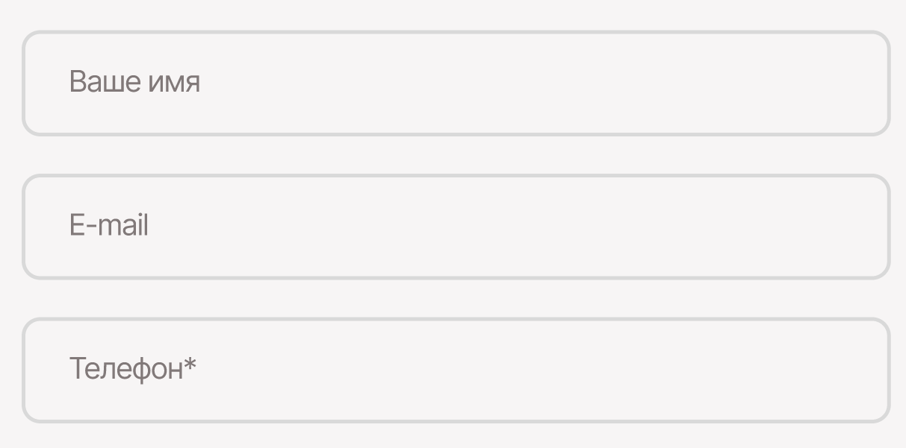
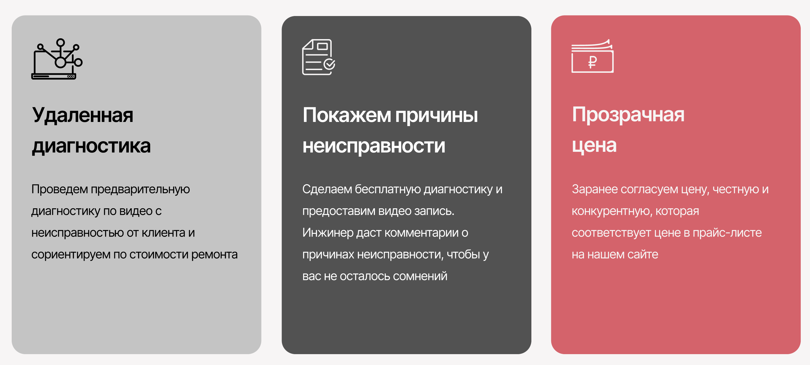
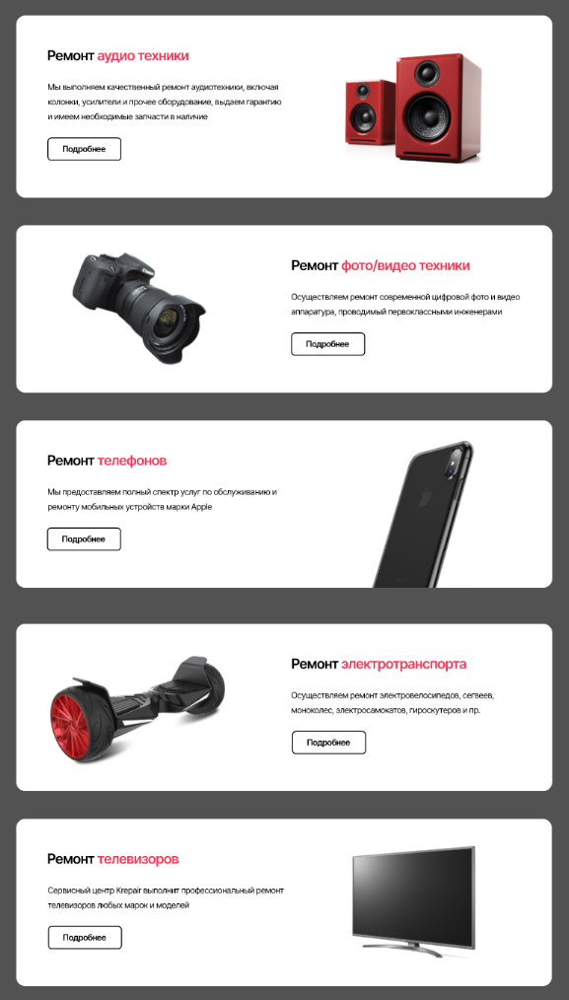

# header: `header.header>nav.header__nav>ul.header__list>li.header__item*4>a.header__link`

# 

# form: `form.form>label.form__label*3>input.form__input`

# 

# cards: `.cards>.card*3>img.card__img+p.card__text_big+p.card__text_small`

# 

# catalogs: `.catalogs>.catalog*5>h3.h3.catalog__h3+p.catalog__p+button.catalog__button+img.catalog__img`

# 
